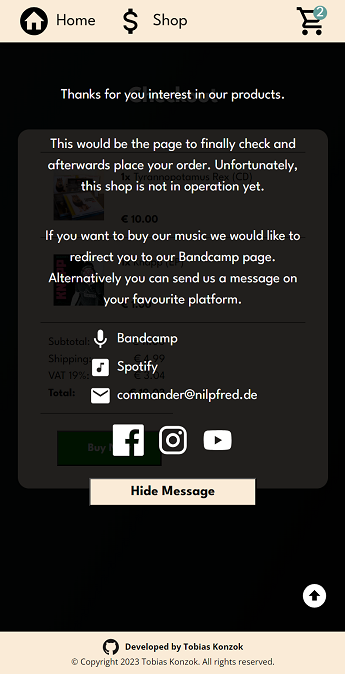

<h1 align="center">Commander Nilpfred Fake Shop</h1>

React project on days 43 - 45 of <a href="https://www.theodinproject.com/lessons/node-path-react-new-shopping-cart">'The Odin Project'</a> web development course. Main focus on routing and testing React with Vitest.

<h2>Demo</h2>

[Live Demo](https://nilpfred-shop.vercel.app/)

<h2>Built with</h2>

- React
- JavaScript
- CSS
- HTML

 

<h2>Features</h2>

- Welcoming page with link to web shop
- All articles presented on shop page
- Data fetched from .json file, including information about current stock
- Notifications when stock below 5 or articles sold out
- Shopping cart as sidebar, listing selected items and current total
- Little number on top of cart icon showing current number of different items in cart
- Redirecting to checkout page on button click showing overview of selected items
- Overlay warning that this shop is not in operation with link to bandcamp page
- Client-side routing between different pages using React Router
- Error message with link back to home page if routing fails
- Full responsiveness for screen sizes from 320 px width

 

<h2>Screenshots</h2>

<h2>External Resources</h2>

- Icons by <a target="_blank" href="https://devicon.dev/">DEVICON</a> and <a target="_blank" href="https://pictogrammers.com/library/mdi/">Pictogrammers</a>
- Images by cBernardy Werbung, Am Brennermoor 39, 23843 Bad Oldesloe
